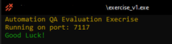
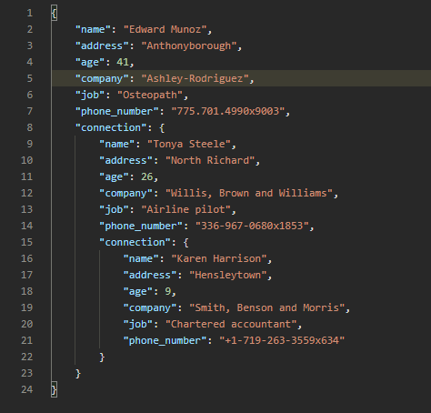
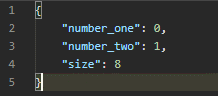
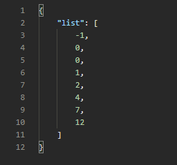

# HOME ASSIGNMENT
This exersice was compressed to an exe and sent to candidates. this was a job for junior QA Automation
### OVERVIEW
This assignment is meant to test your thinking, learning and code writing skills.
The assignment solutions will be reviewed during your scheduled interview.
The assignment will be evaluated by: 
* Code correctness
* Code readability
* Code structure
* Usage of framework features
In the end of the document, we have added some reading material to help you with your tasks
NOTE: It is OK if you do not finish all the assignment parts, but we encourage you to try them all.

### REQUIREMENT & CONSTRAINTS
OS Required: Windows (for Mac and Linux users please contact your instructor)
The assignment must be written in python 3.X using pytest framework.
## TASKS
### SETUP
The assignment folder contains 3 files:
* exercise_v1.exe
* test.js
* Assignment Document
To start the assignment, run the ‘exercise_v1.exe’ file.
If started correctly, you should be able to to see this output (keep it running thourghout your whole work session):  

### INTRODUCTION
Your job is to write automated tests using simple http requests to evalutate the API correctness.
The assigment comes with a lighweight API running on port 7117 on your localhost machine.
Every section will list the needed test function and the some constraints
Sections are sorted by most easy to hardest
#### PART I – Get a key
Like every respected API, we do keep unwanted guests out of our API, although we chose a more simplistic way to tackle the key problem.  
* **TASK 1:** Please write an automated test that will test that if you make a GET request to localhost:7117/ route you will recive back a 401 status code with the error message ‘unauthorized, please provide a valid key’  
* **TASK 2:** Please write an automated test that will test that if you make a POST request to localhost:7117/key, the api will return an key (15 long string)  
* **TASK 3:** Write a test similair to TASK 1, only this time with a ‘key’ property at the request headers, make sure you get back 200 status code with the message ‘Got a key!’  
**NOTE:** You MUST provide a key in the session headers throught all your next part tasks
**NOTE#2:** Making a post request to the key route again, will construct a new key

#### PART II – Confused Developer
One of our (very) confused developers has written one our tests in javascript instead of python, can you please re-write the test.js file in python and make sure its working?  
_P.S. we didn’t add all the modules implementation, but I think you will be able to understand from the context_  
**NOTE:** Don’t forget to add the key to your request headers.
	
#### PART III – Connections, connections, connections…
In earnix we sometime have to test some really complex data structres, in this part we will test our person connection tree generator.
The tree generator will generate a connection tree according to the given depth you specify in the  request query-params. For example: making a GET request to the /tree?depth=3 will predouce a tree of connection of depth 3.

Example of a 2 depth tree:  
   
_As you may see, every person has only one connection, the tree ends where there are not more connections._

Another feature of this person connection tree generator, is to limit the connections max age, this can be done by providing an age query param. For example: making a GET request to the route /tree?&depth=6&age=20 will predouce a connection tree with a depth of 6 where all the persons in the tree maximum 20 year old (via the ‘age’ JSON property)
* **TASK 1:** Write an automated test to make sure you cannot produce a tree larger than 50 and lower than 1
* **TASK 2:** Write an autometed test to make sure the tree depth is as requested, use a recursive function and a non-recursive function.
* **TASK 3:** Write an automated test to make sure that the age constraint works as expected.

#### PART IV – Tipsy Fibonacci
At earnix we run some really complex calculations, in this simple API we developed an Fibonacci series generator  
We have not tested it yet, but we will accpect this generator if it only mistaken by 1. For example if the Nth Fibonacci number should be X, we will accpect it if its also X-1, X or X+1  
To generate a series, provide a json with ‘number_one’, ‘number_two’ and ‘size’ to the /tipsy, make POST request. For example:  
A request with the body as:  
  
Will return:  
 
* **TASK 1:** Write an autometed test to check that the fibbonaci series size is as requested
* **TASK 2:** Write an autometed test to check that each number in the fibbonaci series generated is correct, meaning each Nth number in the series mistaken at most by 1.

#### BONUS: PART V – Bonuses
* **BONUS: PART I** – Use pytest fixture feature to provide the session headers
* **BONUS: PART III** – Task 2: add ‘&hard=True`  and try ro assert the tree depth again, (in this tree, one person can have multiple connections, but the tree max depth stays the same)
* **BONUS: PART IV** – Task 2:  Use pandas to test fibbonachi series

## READING MATERIAL
These guides will help you solve the above tasks  
#### AUTOMATION QA:
* https://www.guru99.com/automation-testing.html
#### REST API:
* https://www.restapitutorial.com/lessons/whatisrest.html
* https://www.freecodecamp.org/news/rest-api-tutorial-rest-client-rest-service-and-api-calls-explained-with-code-examples/
#### PYTHON:
* https://www.w3schools.com/python/
#### PYTEST:
* http://library.sadjad.ac.ir/opac/temp/18467.pdf
* https://docs.pytest.org/en/stable/talks.html
#### PANDAS:
* https://pandas.pydata.org/pandas-docs/stable/getting_started/tutorials.html

### Good luck!!!
